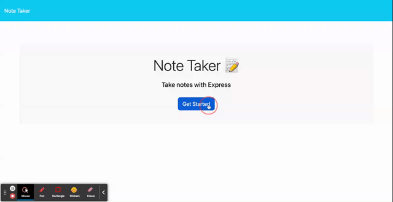

 # Note-Taker

  

  ## Table of Content
  - [Project Description](#Description)
  - [Usage](#Usage)
  - [Installation](#Installation)
  - [Questions](#Questions)
  - [License](#Questions)
  ## Description
  This is a app made for a user to take notes to keep them organized and on task. It will keep track of notes  entered and allow the user to pull them up and delete them.

  ## Usage
   
  
  ## Installation
  This is an application deployed to heroku and can be accesed through the url. When the users enter the site they will be able to write notes, save them and delete them.

  ## Contributing
  N/A

  ## Questions
  - Email: junior_poku@hotmail.com
  - Github: https://github.com/Junya_jp

  ## License  
  N/A